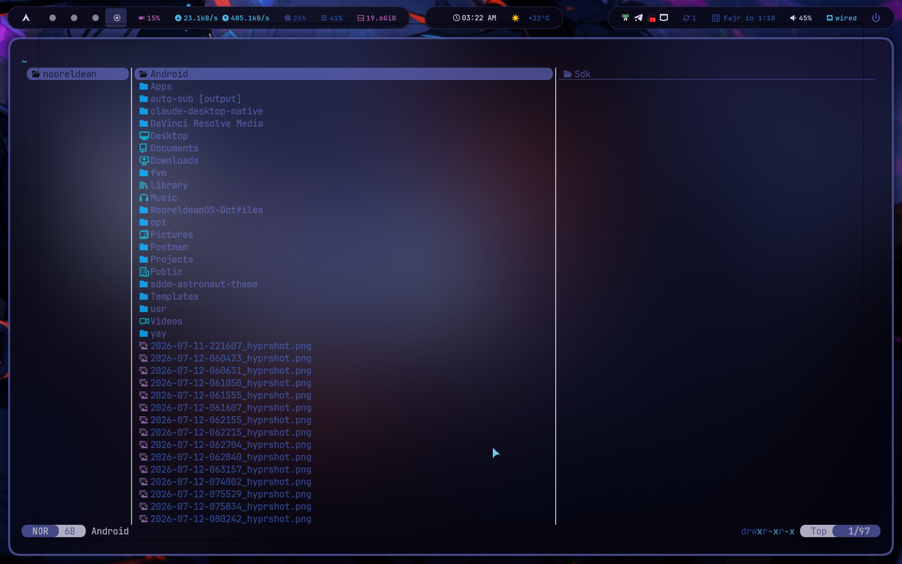
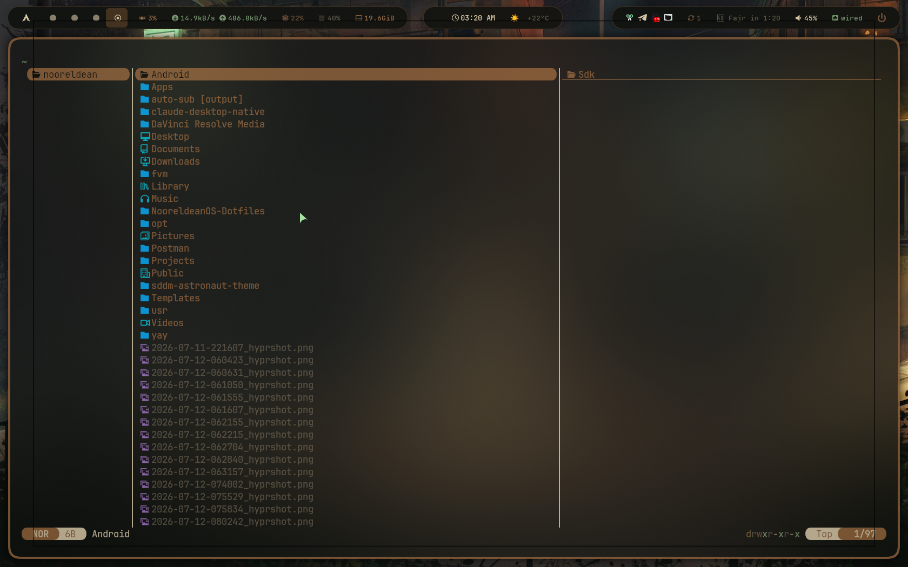
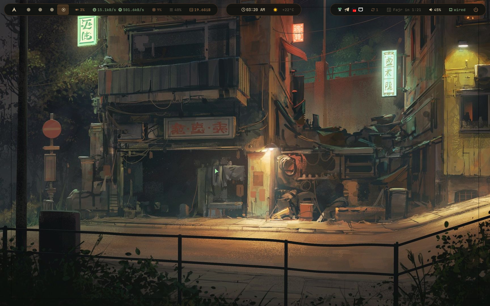
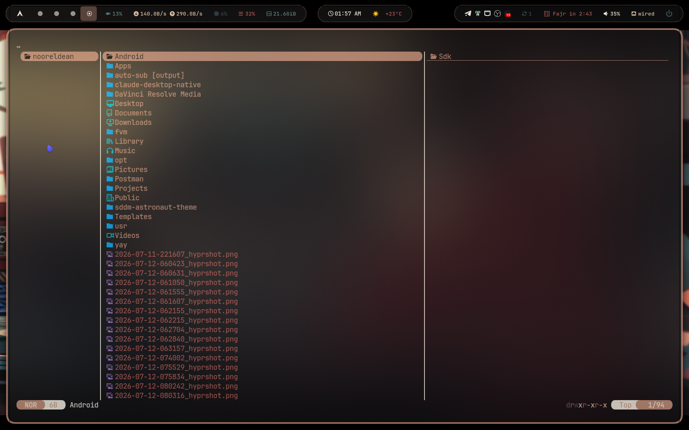
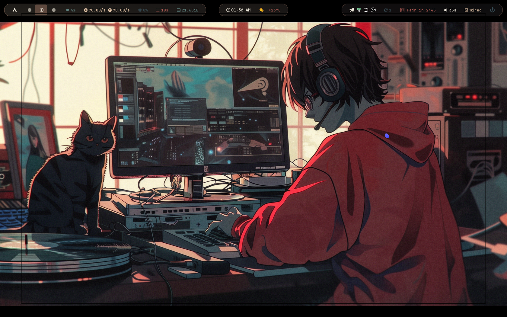

<div align="center">

# 🚀 NooreldeanOS
**The Ultimate Arch Linux Experience**

[](#)
[](#)
[](#)

يا هلا بيك في الـ Dotfiles بتاعتي! المستودع ده فيه كل الإعدادات اللي بستخدمها عشان أروق على نظام لينكس بتاعي وأخليه شغال زي الفل وشكله يفتح النفس. تم بناء النظام بالكامل ليكون سريع، أنيق، وجاهز للاستخدام من أول لحظة.

---

</div>

## 📸 لقطات من النظام (Screenshots)

<p align="center">
  
  
</p>
<p align="center">
  
  
</p>
<p align="center">
  
  
</p>

---

## 🛠️ الـ Stack اللي بستخدمه

الـ Setup ده مبني على مجموعة من أفضل وأحدث الأدوات في عالم اللينكس حالياً:

- **الواجهة (Window Manager):** [Hyprland](https://hyprland.org/) - أنميشنز خرافية وسلاسة ملهاش مثيل.
- **الشريط العلوي (Status Bar):** [Waybar](https://github.com/Alexays/Waybar) - مخصص بالكامل وبشكل أنيق.
- **الـ Launcher:** [Rofi](https://github.com/davatorium/rofi) - عشان تفتح البرامج بسرعة وبشياكة.
- **الـ Terminal:** [Kitty](https://sw.kovidgoyal.net/kitty/) - سريع جداً ومريح للعين.
- **شكل الـ Prompt:** [Starship](https://starship.rs/) - تيرمينال شيك ومفيد.
- **الـ Themes:** [Kvantum](https://github.com/tsujan/Kvantum) - تناسق تام في أشكال البرامج.
- **الإشعارات (Notifications):** [SwayNC](https://github.com/ErikReider/SwayNotificationCenter) - مركز إشعارات متكامل.
- **قائمة الخروج (Logout Menu):** [Wlogout](https://github.com/ArtsyMacaw/wlogout) - أزرار تحكم أنيقة.
- **معلومات النظام:** [Fastfetch](https://github.com/fastfetch-cli/fastfetch) - بيعرض إمكانيات جهازك بشكل احترافي.
- **شاشة الدخول (Login Manager):** [SDDM](https://github.com/sddm/sddm) - مع ثيم [Astronaut](https://github.com/Keyitdev/sddm-astronaut-theme) الفضائي.
- **مُنسق الألوان:** [Pywal](https://github.com/dylanaraps/pywal) - بيغير ألوان النظام كله أوتوماتيك بناءً على الخلفية! 🎨

---

## ✨ مميزات حصرية (Features)

- 🎨 **Pywal Integration**: بمجرد ما تغير الخلفية، النظام بيغير ألوان **كل حاجة** أوتوماتيك — Hyprland، Waybar، SwayNC، Qt Apps، وحتى الـ Cursor.
- 🖼️ **Wallpaper Picker**: أداة بواجهة رسومية (GUI) بتختار منها الخلفية وبتطبق الألوان لوحدها في ثواني.
- 🧹 **System Cleaner**: بينضف الكاش والباكدجات القديمة بضغطة واحدة من الـ Launcher لتوفير المساحة.
- 📦 **System Updater**: بيعمل أبديت لكل حاجة في النظام (pacman + AUR + Flatpak) بضغطة واحدة.
- 🔒 **Hyprlock**: شاشة قفل خرافية مع Blur وألوان متناسقة مع الـ Theme.

---

## 🛡️ أمان الهاردوير (Hardware Agnostic)

حلاوة الـ Dotfiles دي إنها **مفلترة ومتنضفة** من أي إعدادات خاصة بالهاردوير بتاعي (زي تعريفات كروت الشاشة، تحديثات المعالج، والـ Boot). 
يعني تقدر تاخد الملفات دي وتسطبها على **أي جهاز في العالم** وأنت مطمن إنها مش هتعمل تعارض مع الهاردوير بتاعك! 💯

---

## ⚙️ إزاي تسطب العظمة دي؟ (Installation)

عندك طريقتين للتسطيب، اختار اللي تناسبك:

### 1️⃣ تسطيب نظام Arch بالكامل من الصفر (بضغطة زرار) 🪄
لو أنت لسه محمل أسطوانة Arch Linux (ISO) وعايز تفرمت وتنزل النظام كله وتسطب NooreldeanOS مرة واحدة، كل اللي هتعمله إنك تشبك نت وتكتب الأمر السحري ده في التيرمينال:

```bash
bash <(curl -sL https://raw.githubusercontent.com/coach-nooreldean/NooreldeanOS-Dotfiles/main/start.sh)
```
> **ملاحظة:** الاسكريبت هيسألك هتنزل النظام على أنهي هارد، وبعدها هيفرمت، ينزل Arch، يعمل الإعدادات الأساسية (الشبكة، الوقت، اسم الجهاز، واسم المستخدم) ويظبط كل حاجة أوتوماتيك!

### 2️⃣ التسطيب على نظام Arch شغال بالفعل (سطر واحد بس!) 🏎️
لو أنت مسطب Arch Linux أصلاً وعايز تركب الـ Dotfiles دي بس، افتح التيرمينال واكتب:

```bash
git clone https://github.com/coach-nooreldean/NooreldeanOS-Dotfiles.git ~/NooreldeanOS-Dotfiles && cd ~/NooreldeanOS-Dotfiles && bash install.sh
```

**الاسكريبت ده أذكى مما تتخيل:**
- هيسطب كل البرامج والأدوات المطلوبة أوتوماتيك.
- هياخد باك أب (Backup) من إعداداتك القديمة عشان ترجعلها لو حبيت.
- **هيتعرف على اسم المستخدم بتاعك** ويعدل المسارات أوتوماتيك (مش هتحتاج تغير أي كود!).
- هيظبط الـ Services كلها ويخلي الجهاز جاهز.

---

## ⌨️ أهم الاختصارات (Keybindings)

| الاختصار (Shortcut) | الوظيفة (Action) |
| :--- | :--- |
| `Super + Return` | فتح التيرمينال (Kitty) |
| `Super + R` | فتح قائمة البرامج (Rofi Launcher) |
| `Super + Q` | قفل النافذة الحالية |
| `Super + E` | مدير الملفات (Yazi / Thunar) |
| `Super + B` | فتح المتصفح |
| `Super + T` | فتح تليجرام |
| `Super + L` | قفل الشاشة (Hyprlock) |
| `Super + V` | الحافظة (CopyQ Clipboard) |
| `Super + S` | أخد سكرين شوت لمنطقة معينة |
| `Print Screen` | أخد سكرين شوت للشاشة كاملة |
| `Super + F` | تحويل النافذة لـ Float |
| `Super + Shift + F` | ملء الشاشة (Fullscreen) |
| `Super + N` | فتح مركز الإشعارات (SwayNC) |
| `Super + Escape` | قائمة الخروج وإعادة التشغيل (Wlogout) |
| `Super + 1-0` | التنقل بين مساحات العمل (Workspaces) |
| `Alt + Shift` | تبديل لغة الكيبورد (EN/AR) |

---
<div align="center">
<b>صُنع بحب من أجل مجتمع اللينكس 🐧❤️</b>
</div>
